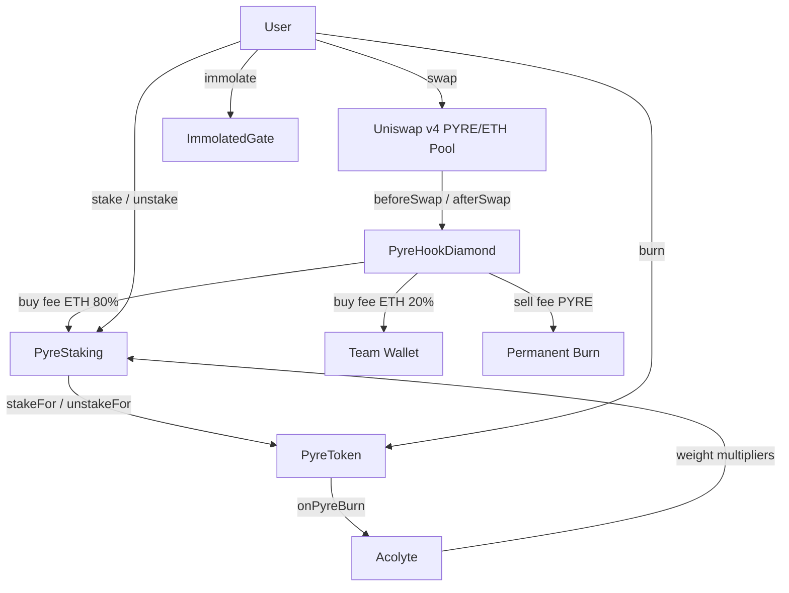

# Pyre Protocol

Pyre is an on-chain economic system built around **$PYRE**, a deflationary ERC-20 with epoch-based decay on liquid balances, ETH yield staking, burn-driven NFT progression, and a Uniswap v4 swap hook that routes fees to stakers and permanent burns.

Built with [Foundry](https://book.getfoundry.sh/) · Solidity `0.8.24` · OpenZeppelin v5

---

## Overview

| Layer | Contract | Role |
|-------|----------|------|
| Token | `PyreToken` | ERC-20 with lazy decay, 7-day unstake drip, **1B hard cap** |
| Staking | `PyreStaking` | Stakes $PYRE (decay paused), accrues ETH yield |
| NFT | `Acolyte` | Burn-progression NFT; staking weight multipliers |
| Gate | `ImmolatedGate` | Hall of the Immolated access flag |
| Hook | `PyreHookDiamond` | Uniswap v4 diamond hook — swap fees, burns, yield routing, **15% max tax** |



---

## $PYRE Token (`PyreToken`)

Standard ERC-20 with three balance buckets and a **hard supply cap**:

- **Hard Supply Cap** — 1,000,000,000 $PYRE (enforced on-chain in `mint`)
- **Liquid** — transferable; subject to epoch decay
- **Staked** — held by `PyreStaking`; decay paused
- **Drip** — 7-day linear vesting after unstake; no decay until claimed

### Epoch decay (lazy)

Decay applies only to **liquid** balances, computed lazily on interaction (transfers, burns, stakes, claims):

| Parameter | Value |
|-----------|-------|
| Epoch duration | 1 hour |
| Era 0 rate | 0.45% / hour |
| Halving interval | every 2,000 epochs |
| Floor rate | 0.01% / hour |

The contract stores each wallet's raw balance and a decay index snapshot. On touch, the global decay index is synced and the wallet balance is normalized — no iteration over holders.

### Staking integration

Only `PyreStaking` may call `stakeFor` / `unstakeFor`. Unstaking starts a 7-day drip schedule; users claim liquid $PYRE via `claimDrip()`.

### Burns

`burn()` and `burnFrom()` destroy liquid $PYRE and notify `Acolyte` via the configured `burnTracker`.

---

## Staking (`PyreStaking`)

- **No minimum stake**, no hard lock — exit always available via the 7-day drip
- Staked $PYRE does not decay
- **ETH yield** accrues continuously via a Synthetix-style reward-per-weight accumulator (O(1) per user)

### Yield weight

```
weight = stakedAmount × NFT stage multiplier × LP burn bonus × whitelist boost
```

| Multiplier | Source | Default |
|------------|--------|---------|
| NFT stage | `Acolyte` | 1× – 3× |
| LP burn bonus | `Acolyte.flagLpBurner` | +20% (1.2×) |
| Whitelist boost | Stake within 48h of launch | 1.2× for first 7 days |

### ETH funding

- **Admin:** `notifyRewardAmount{value: amount}(amount, duration)`
- **Hook:** `depositYield()` — callable only by `yieldRouter` (the hook diamond)

### NFT transfer settlement

When an `Acolyte` is transferred, `onWeightFactorsChanged` settles the seller's pending ETH rewards and refreshes both parties' staking weights. Yield earned before the transfer goes to the seller; the buyer accrues from that point forward.

---

## Acolyte NFT (`Acolyte`)

Earned automatically through cumulative $PYRE burns. Partial burns accumulate — no progress is lost between transactions.

### Stages (same token ID, progressive)

| Stage | Cumulative burn | Staking multiplier |
|-------|-----------------|-------------------|
| EMBER | 10,000 $PYRE | 1× |
| FLAME | 75,000 $PYRE | 1.5× |
| FORGE | 150,000 $PYRE | 2× |
| PYRE | 300,000 $PYRE | 3× |

A wallet holding a PYRE-stage acolyte staking 10,000 $PYRE has the same yield weight as a non-NFT holder staking 30,000 $PYRE.

### LP burners

Wallets that lock their ETH+$PYRE Uniswap v4 LP positions are flagged on-chain via `flagLpBurner()` (`LP_RECORDER_ROLE`). Flagged wallets receive a +20% yield weight bonus on top of their stage multiplier. This is triggered by calling `burnLpPosition(tokenId)` on the hook diamond.

---

## Hall of the Immolated (`ImmolatedGate`)

Entry requires:

1. A **PYRE-stage** `Acolyte` (300k cumulative burn)
2. An additional **10,000 $PYRE** burn

Sets `isImmolated[address] = true` for frontend access to the Hall of the Immolated.

```solidity
token.approve(address(gate), 10_000 ether);
gate.immolate();
```

---

## Uniswap v4 Hook (`PyreHookDiamond`)

Deployed as an **EIP-2535 Diamond Proxy** — a single proxy holding all ETH and storage, with logic split across independently upgradeable facets:

| Facet | Responsibility |
|-------|----------------|
| `SwapHookFacet` | `beforeSwap` / `afterSwap` IHooks callbacks |
| `FeeLogicFacet` | Fee calculation, anti-snipe schedule, pool registration, **15% max tax ceiling** |
| `BurnFacet` | Permanent $PYRE burn on sell-side swaps |
| `YieldDistributionFacet` | Routes buy-side ETH fees (80% staking / 20% team) |
| `LpBurnFacet` | LP position locking and Acolyte flagging |
| `DiamondCutFacet` | EIP-2535 upgrades |
| `DiamondLoupeFacet` | Introspection |
| `OwnershipFacet` | Admin ownership |

### Swap fees & Honeypot Protection

| Side | At launch | After 12 hours | Destination |
|------|-----------|----------------|-------------|
| Buy (ETH in) | 10% | 5% | 80% → yield pool · 20% → team |
| Sell (PYRE in) | 23% | 5% | 100% permanently burned |

**Honeypot Protection:** Fees are subject to a **hard 15% ceiling** (`MAX_FEE_BPS = 1500`). Any attempt to configure fees above this value will revert, ensuring the contract can never be turned into a honeypot.

Fees decay linearly over 12 hours (anti-snipe), then settle at 5% buy / 5% sell.

### Hook address requirement

Uniswap v4 encodes required hook permissions in the contract address (low bits). This diamond needs `beforeSwap | afterSwap | beforeSwapReturnDelta` (`0xC8`). Deploy via **CREATE2 mining** and verify with `PyreHookDiamondDeployer.validateHookAddress()`.

---

## Contract wiring

```
PyreToken.stakingContract  →  PyreStaking
PyreToken.burnTracker        →  Acolyte
PyreStaking.weightFactors    →  Acolyte
PyreStaking.yieldRouter      →  PyreHookDiamond
ImmolatedGate                →  PyreToken + Acolyte (read-only + burnFrom)
```

---

## Project structure

```
src/
├── tokens/PyreToken.sol
├── staking/PyreStaking.sol
├── nft/Acolyte.sol
├── gate/ImmolatedGate.sol
├── hook/
│   ├── diamond/          # EIP-2535 proxy + deployer
│   ├── facets/           # Swap, fee, burn, yield, diamond admin
│   ├── libraries/        # EIP-7201 storage + fee/burn/yield logic
│   ├── init/             # DiamondInit
│   └── v4/               # Minimal Uniswap v4 types
├── interfaces/
└── mocks/

script/
├── DeployPyre.s.sol      # Core protocol
└── DeployPyreHook.s.sol  # V4 hook diamond

test/
├── PyreToken.t.sol
├── PyreStaking.t.sol
├── Acolyte.t.sol
├── ImmolatedGate.t.sol
├── PyreHookDiamond.t.sol
└── PyreIntegrationTest.t.sol
```

---

## Development

### Prerequisites

- [Foundry](https://book.getfoundry.sh/getting-started/installation)
- Git submodules: `forge-std`, `openzeppelin-contracts`

```bash
git submodule update --init --recursive
```

### Build

```bash
forge build
```

### Test

```bash
forge test -vv
```

---

## Deployment

### 1. Core protocol

```bash
forge script script/DeployPyre.s.sol:DeployPyre \
  --rpc-url $RPC_URL \
  --broadcast
```

Deploys: `PyreToken`, `PyreStaking`, `Acolyte`, `ImmolatedGate` — fully wired.

### 2. Uniswap v4 hook

```bash
forge script script/DeployPyreHook.s.sol:DeployPyreHook \
  --rpc-url $RPC_URL \
  --broadcast
```

After hook deploy:

```bash
# On PyreStaking (owner)
staking.setYieldRouter(hookDiamondAddress)
```

### 3. External integrations

| Integration | Action |
|-------------|--------|
| LP burn router | Call `Acolyte.flagLpBurner(wallet)` via `LpBurnFacet` |
| Whitelist | Call `PyreStaking.setWhitelisted(wallet, true)` |
| ETH rewards | Call `PyreStaking.notifyRewardAmount{value: X}(X, duration)` |

---

## License

See individual contract SPDX headers. Core protocol contracts use `MIT` unless otherwise noted.
